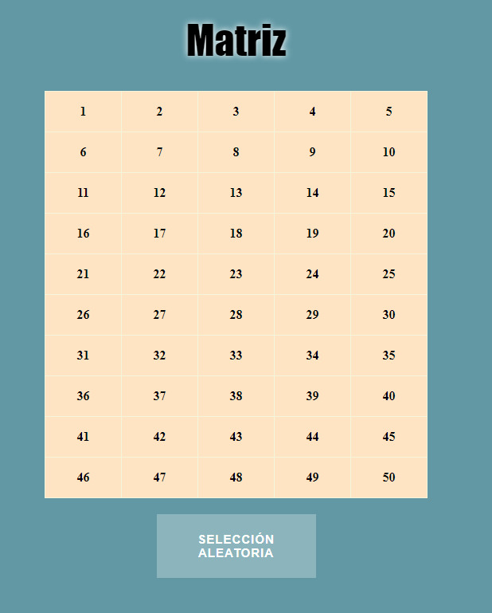
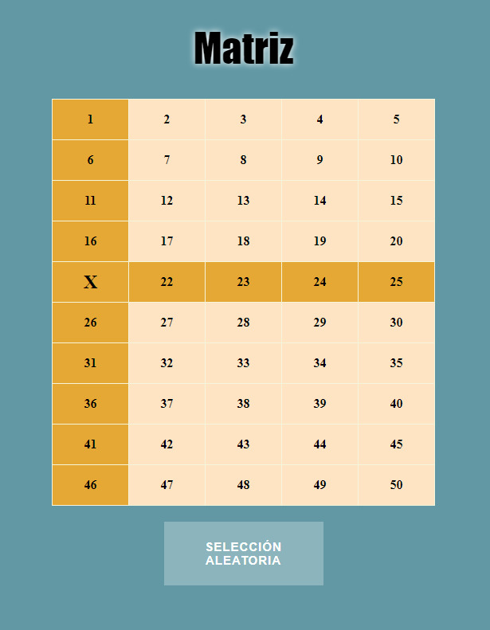

# Prueba técnica

Prueba tecnica trabajo Accedo

## Traductor código morse

### 1) Interfaz para elegir la acción a realizar (1, 2, 3)

    def main ():
        while True:
            print ("\n¿Que deseas hacer?")
            print ("\n1) Traducir de texto a morse.")
            print ("2) Traducir de morse a texto.")
            print ("3) Salir del programa")
            eleccion = input ("Seleccione la opción que desea realizar (1, 2, 3): ")
            if eleccion == "1":
                texto = input ("\nIngresa el texto a traducir: ")
                morse = texto_a_morse (texto)
                print ("\nLa traducción a morse es:", morse)
            elif eleccion == "2":
                print ("\nNOTA: Registre el codigo agregando un espacio al final de cada combinación")
                morse = input ("Ingresa el código morse a traducir: ")
                texto = morse_a_texto (morse)
                print ("\nLa traducción a texto es:", texto)
            elif eleccion == "3":
                break
            else:
                print ("La opción seleccionada no se encuentra, intenta nuevamente")

    main()`

### 2) Diccionario de texto a morse

        diccionario_morse = {
            'A': '.-', 'B': '-...', 'C': '-.-.', 'D': '-..', 'E': '.', 'F': '..-.', 'G': '--.',
            'H': '....', 'I': '..', 'J': '.---', 'K': '-.-', 'L': '.-..', 'M': '--', 'N': '-.',
            'O': '---', 'P': '.--.', 'Q': '--.-', 'R': '.-.', 'S': '...', 'T': '-', 'U': '..-',
            'V': '...-', 'W': '.--', 'X': '-..-', 'Y': '-.--', 'Z': '--..',
        }

### 3) Función para traducir de texto a código morse

    def texto_a_morse (texto):

        texto = texto.upper ()

        diccionario_morse = {
            'A': '.-', 'B': '-...', 'C': '-.-.', 'D': '-..', 'E': '.', 'F': '..-.', 'G': '--.',
            'H': '....', 'I': '..', 'J': '.---', 'K': '-.-', 'L': '.-..', 'M': '--', 'N': '-.',
            'O': '---', 'P': '.--.', 'Q': '--.-', 'R': '.-.', 'S': '...', 'T': '-', 'U': '..-',
            'V': '...-', 'W': '.--', 'X': '-..-', 'Y': '-.--', 'Z': '--..',
        }

        traduccion_a_morse = []

        for letra in texto:
            if letra in diccionario_morse:
                traduccion_a_morse.append(diccionario_morse[letra])
            elif letra == " ":
                traduccion_a_morse.append(" ")
            else:
                traduccion_a_morse.append(letra)

        return ' '.join (traduccion_a_morse)

### 4) Diccionario de código morse a texto

    diccionario_texto = {
            '.-': 'a', '-...': 'b', '-.-.': 'c','-..': 'd', '.': 'e', '..-.': 'f', '--.': 'g',
            '....': 'h', '..': 'i', '.---': 'j', '-.-': 'k', '.-..': 'l', '--': 'm', '-.': 'n',
            '---': 'o', '.--.': 'p', '--.-': 'q', '.-.': 'r', '...': 's', '-': 't', '..-': 'u',
            '...-': 'v', '.--': 'w', '-..-': 'x', '-.--': 'y', '--..': 'z',
        }

### 5) Traducción de código morse

    def morse_a_texto (morse):

        codigo_letra = morse.split (" ")

        diccionario_texto = {
            '.-': 'a', '-...': 'b', '-.-.': 'c','-..': 'd', '.': 'e', '..-.': 'f', '--.': 'g',
            '....': 'h', '..': 'i', '.---': 'j', '-.-': 'k', '.-..': 'l', '--': 'm', '-.': 'n',
            '---': 'o', '.--.': 'p', '--.-': 'q', '.-.': 'r', '...': 's', '-': 't', '..-': 'u',
            '...-': 'v', '.--': 'w', '-..-': 'x', '-.--': 'y', '--..': 'z',
        }

        traduccion_a_texto = []

        for codigo in codigo_letra:
            if codigo in diccionario_texto:
                traduccion_a_texto.append (diccionario_texto[codigo])
            elif codigo == "":
                traduccion_a_texto.append (" ")
            else:
                traduccion_a_texto.append (codigo)

        return ''.join (traduccion_a_texto)

## Matriz

### Interfaz de la matriz

Matriz generada con javascript, donde se pueden seleccionar sus celdas y esto desactivará la posible seleccion de sus respectivas filas y columnas.

### Selección de celda

Se puede seleccionar cualquier celda de la matriz, a no ser que estas estén deshabilitadas.

### Boton de selección aleatoria

Se añade un boton con la funcion de elegir una casilla aleatoria de la matriz y deshabilitar sus respectivas filas y columnas.

